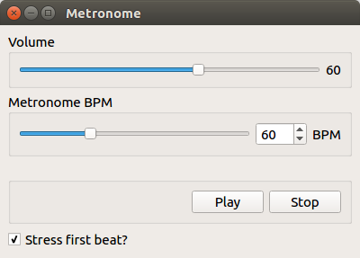

# Metronome

A Qt based Metronome



## Installation

Run the following in the extracted folder:
```
cmake -H. -Bbuild
cmake --build build -- -j3
```
The generated executable could be found in the `build` folder.
